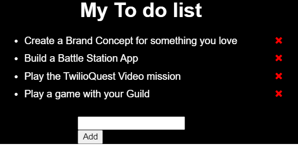
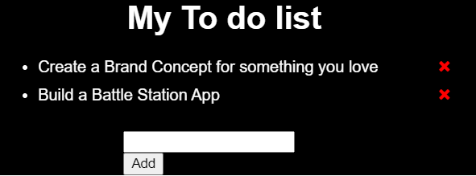

# A simple To-Do List Web App

## We can perform:
> Add

> Complete

> Delete

**Operations on the Tasks.**

## Built On:

> HTML

> CSS

> JS

## Using

> <a href= "https://jsbin.com/" target="_blank">JS Bin</a>

## <a href= "https://jsbin.com/suhaxiqufo/edit?html,css,js" target="_blank">Code</a>

## <a href= "https://jsbin.com/suhaxiqufo/edit?output" target="_blank">Site</a>

## <a href= "https://youtu.be/41o6ajawnbE" target="_blank">Working</a>
